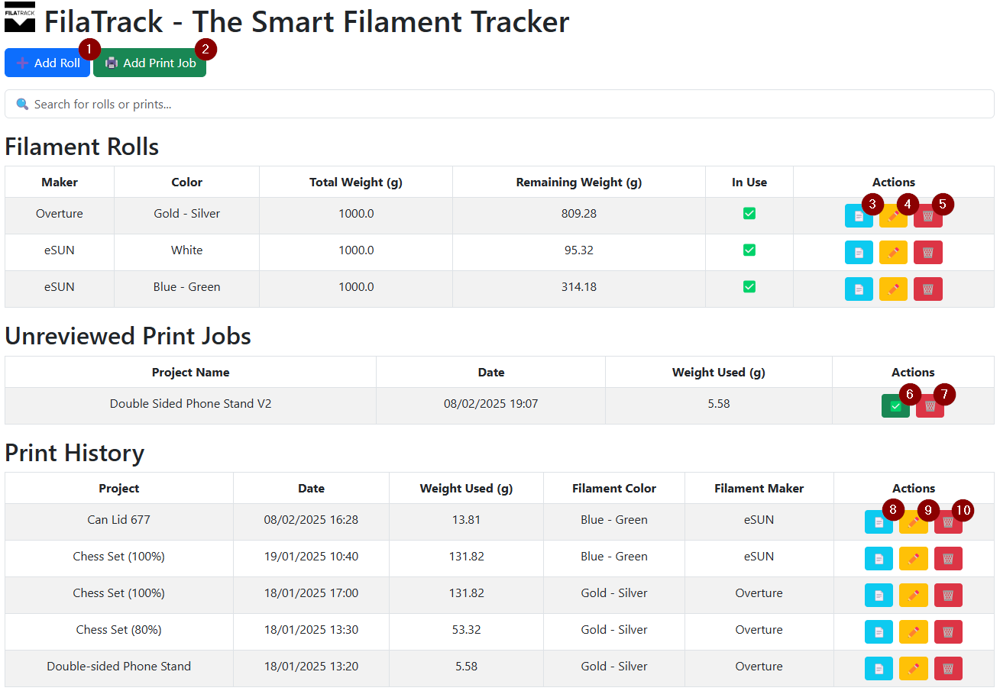

# Filament Tracker

Filament Tracker is a **Flask-based Python web app** for managing **3D printing filament usage and print jobs**.
It tracks **filament rolls**, logs **print jobs**, and integrates with **PrusaSlicer** to automatically import print data.

## Features

- **Filament Roll Management**: Add, edit, duplicate, and delete filament rolls.
- **Print Job Tracking**: Log print jobs, assign them to specific filament rolls, and track filament usage.
- **Unreviewed Print Jobs**: Temporary print job storage for review and approval.
- **PrusaSlicer Integration**: Automatically import print job details from G-code.
- **Search and Filter**: Easily search and filter through filament rolls and print jobs.
- **Data Persistence**: Uses an SQLite database to store all information.
- **Bootstrap-based UI**: Responsive and user-friendly design.

## Prerequisites

Ensure you have the following installed on your system:

- Docker
- Docker Compose

## Installation

1. Clone the repository:

   ```shell
   git clone https://github.com/mrfenyx/filament-tracker.git
   cd filament-tracker
   ```

2. Run the application using Docker Compose:

   ```shell
   docker-compose up -d --build
   ```

3. The database will be stored in the `./data/` directory, which should be backed up regularly to prevent data loss.

## Running the Application

The application will run as a Docker container. Access it in your browser at [http://127.0.0.1:5000/](http://127.0.0.1:5000/).

## PrusaSlicer Integration

Filament Tracker can automatically capture **filament usage and project names** from **PrusaSlicer** using a post-processing script.

### ✅ How It Works

1. When you slice a model in **PrusaSlicer**, it executes `prusa_post.py` as a post-processing script.
2. This script extracts relevant metadata from the generated G-code file, such as:
   - **Filament weight (g)**
   - **Project name (from filename or PrusaSlicer environment variables)**
   - **Slicing timestamp**
3. The extracted data is sent to Filament Tracker as an **unreviewed print job**, where you can assign a filament roll and finalize it.

### 🔧 Setting Up the Integration

#### **1️⃣ Edit the prusa_post.py File**

Set environmental variables in the system:

1. `FILAMENT_TRACKER_API_URL`: set the URL of the API Endpoint
2. `ARCWELDER_PATH`: set the path of Arcwelder.exe (if using it, e.g. for Anycubic printers)

You can also edit it directly in the prusa_post.py file but this may need updates on code changes in the future, so it is not recommended.

#### **2️⃣ Add the Post-Processing Script in PrusaSlicer**

1. Open **PrusaSlicer**.
2. Go to **Printer Settings → Custom G-code → Post-processing scripts**.
3. Add the following command (adjust the path to your script):

   ```shell
   "C:\Users\YourUser\path\to\python.exe" "C:\path\to\prusa_post.py"
   ```

   - Replace `C:\Users\YourUser\path\to\python.exe` with your actual Python path.
   - Replace `C:\path\to\prusa_post.py` with the actual script location.

#### **3️⃣ How to Manually Run `prusa_post.py` (Testing)**

You can manually run the script to test how it processes a G-code file:

```bash
python prusa_post.py "C:\path\to\your_model.gcode"
```

If successful, you should see something like:

```plaintext
INFO:root:Processing G-code: arcwelder/test.gcode
INFO:root:Successfully sent data to Filament Tracker API
```

#### **4️⃣ Assigning the Unreviewed Print Jobs**

1. Open Filament Tracker (`http://localhost:5000`).
2. Under **Unreviewed Print Jobs**, find the newly added entry.
3. Click **Approve**, select the correct filament roll, adjust values if needed, and save the print job.

## Usage



### Adding a Filament Roll

- Click on the 1️⃣ **"Add Roll"** button.
- Enter details like Maker, Color, Total Weight, and Remaining Weight.
- Click **"Add Roll"** to save it.

### Logging a Print Job

- Click on the 2️⃣ **"Add Print Job"** button.
- Select a filament roll, enter the print job details, and click **"Add Print Job"**.
- The remaining filament weight will automatically be updated.

### Reviewing Temporary Print Jobs

- Temporary jobs appear in the **"Unreviewed Print Jobs"** section.
- Click 6️⃣ **✅ Approve** to finalize a job.
- Click 7️⃣ **🗑️ Delete** to remove it.

### Managing Filament Rolls and Print Jobs

Each entry has action buttons:

- 3️⃣ & 8️⃣ **📄 Duplicate**: Clone an existing filament roll or print job.
- 4️⃣ & 9️⃣ **✏️ Edit**: Modify the details.
- 5️⃣ & 🔟 **🗑️ Delete**: Remove an entry (deleting a filament roll will also delete associated print jobs).

## Database Management

The database is mounted to the local `./data/` directory as defined in `docker-compose.yml` (feel free to change this):

```yaml
    volumes:
      - ./data:/app/data
```

**Ensure that this folder is backed up regularly to avoid data loss.**

## License

This project is open-source and available under the MIT License.

---
Happy Printing! 🎨🎭
